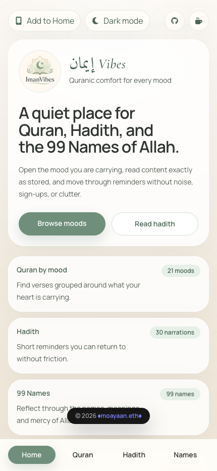
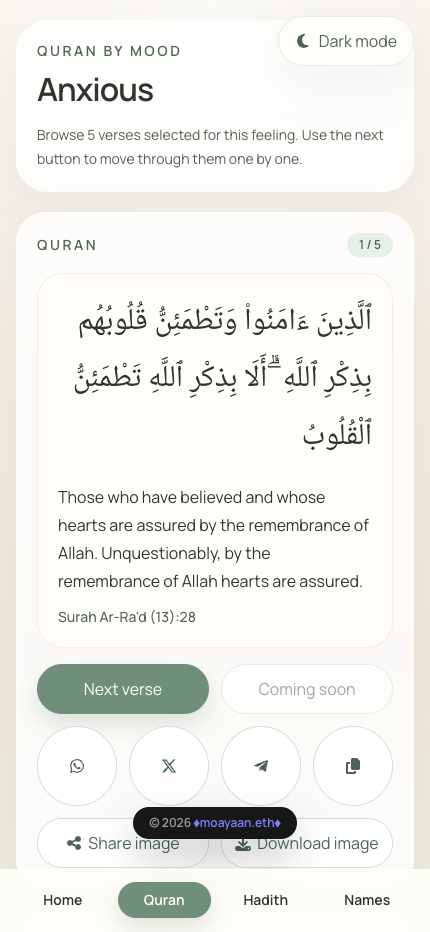
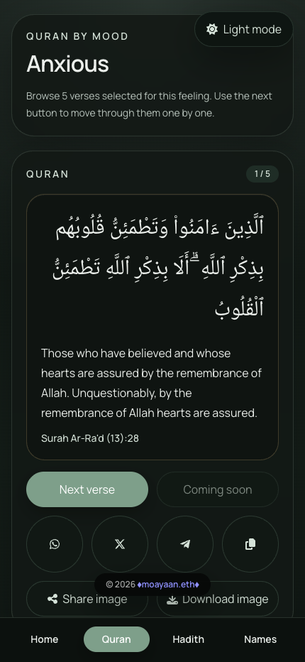
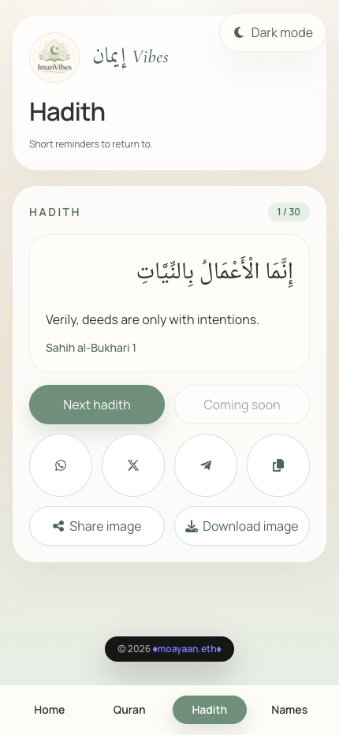
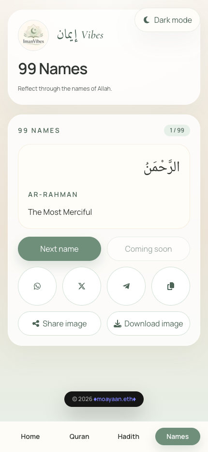
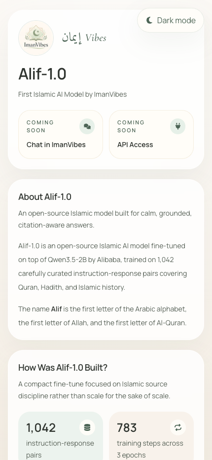
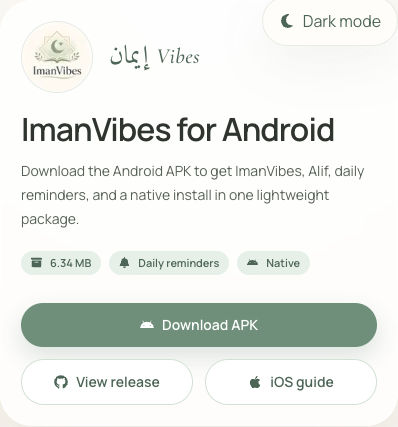
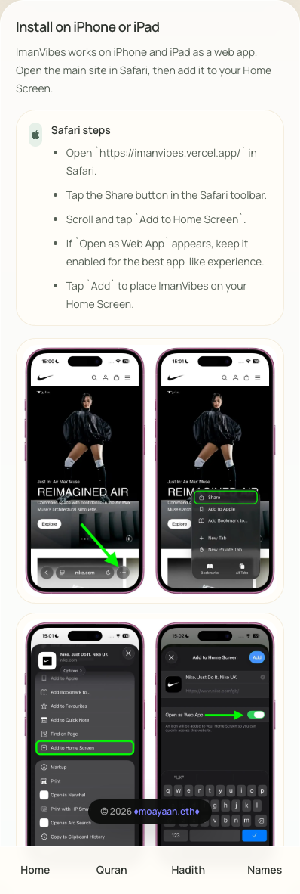
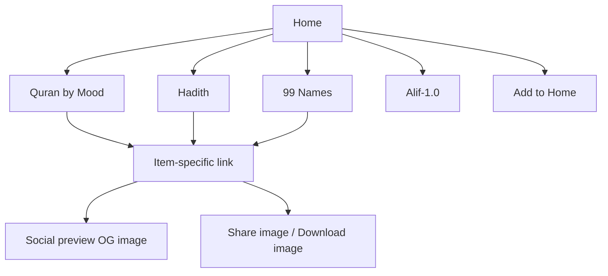

# ImanVibes

Quranic comfort for every mood.

<p align="center">
  
</p>

[](https://imanvibes.vercel.app/)


ImanVibes is a calm, mobile-first Islamic web app built around a simple idea: open the Quran by how you feel right now, then move through a small set of verses without noise, sign-ups, or clutter. Alongside Quran by mood, the app includes Hadith and the 99 Names of Allah in the same quiet, text-first experience.

The project now also includes **Alif-1.0**, the first Islamic AI model by ImanVibes, with its own landing page inside the same product.

It is intentionally lightweight:

- no auth
- no backend
- no external APIs
- local read-only JSON data
- installable as a Progressive Web App

## Live

- App: [https://imanvibes.vercel.app/](https://imanvibes.vercel.app/)
- Android app page: [https://imanvibes.vercel.app/app](https://imanvibes.vercel.app/app)
- Alif page: [https://imanvibes.vercel.app/alif](https://imanvibes.vercel.app/alif)
- Alif on Hugging Face: [https://huggingface.co/mdayaan1911/alif-1.0](https://huggingface.co/mdayaan1911/alif-1.0)
- GitHub: [https://github.com/moayaan1911/imanvibes](https://github.com/moayaan1911/imanvibes)

## Preview

| Home                                                        | Quran Light                                                       | Quran Dark                                                      |
| ----------------------------------------------------------- | ----------------------------------------------------------------- | --------------------------------------------------------------- |
|  |  |  |

| Hadith                                                | 99 Names                                               | Alif-1.0                                              |
| ----------------------------------------------------- | ------------------------------------------------------ | ----------------------------------------------------- |
|  |  |  |

| Android App Landing                                        | iOS Install Guide                                           |
| ---------------------------------------------------------- | ----------------------------------------------------------- |
|  |  |

## What The App Does

- Browse Quran verses grouped by mood
- Read one item at a time in a clean, card-based flow
- Open Hadith and the 99 Names of Allah in the same interface
- Explore **Alif-1.0**, the first Islamic AI model by ImanVibes
- Share each item by link, WhatsApp, X, Telegram, share image, or download image
- Generate dynamic Open Graph images for the homepage and quote pages
- Install the site to the home screen / dock as a PWA
- Persist dark mode across visits

## Core Experience



## Routes

| Route           | Purpose                                       |
| --------------- | --------------------------------------------- |
| `/`             | Landing page and entry point                  |
| `/app`          | Android APK download page and iOS install guide |
| `/alif`         | Alif-1.0 landing page                         |
| `/quran`        | Mood picker                                   |
| `/quran/[mood]` | Quran verses filtered by mood                 |
| `/hadith`       | Hadith collection landing page                |
| `/hadith/[item]`| Item-specific Hadith page                     |
| `/names`        | 99 Names collection landing page              |
| `/names/[item]` | Item-specific Name page                       |
| `/temp`         | Local OG preview route for development review |

## PWA Features

- Installable in supported browsers
- `manifest.webmanifest` with icons, shortcuts, and screenshots
- Custom service worker for route and asset caching
- Add to Home button with browser-specific fallback guidance
- Desktop Chrome install flow verified
- Safari desktop fallback verified via `File -> Add to Dock`

### Install Notes

- `Chrome on desktop`: should show a real install prompt
- `Safari on Mac`: uses Add to Dock, not the Chrome-style prompt
- `Arc on Mac`: does not behave like Chrome for PWA install
- `iPhone / iPad`: uses Share -> Add to Home Screen

## Sharing

Each Quran, Hadith, and Name card supports:

- next item navigation
- item-specific deep links
- WhatsApp share
- X share
- Telegram share
- branded share image
- branded image download

The exported image is intentionally rendered in the light share-card style, even if the app is being viewed in dark mode.

## Alif-1.0

Alif-1.0 is the first Islamic AI model by ImanVibes. Inside this repo, it currently has a dedicated product page at [`/alif`](https://imanvibes.vercel.app/alif), while the public model listing lives on Hugging Face:

- Product page: [https://imanvibes.vercel.app/alif](https://imanvibes.vercel.app/alif)
- Hugging Face: [https://huggingface.co/mdayaan1911/alif-1.0](https://huggingface.co/mdayaan1911/alif-1.0)

The `/alif` route includes:

- route-specific metadata
- its own OG image
- `SoftwareApplication` JSON-LD
- sitemap and `llms.txt` discoverability

## SEO And GEO

The app includes a full metadata foundation for both traditional search and AI-driven discovery:

- canonical metadata
- Open Graph metadata
- Twitter card metadata
- route-aware item metadata for quote pages
- dynamic OG image generation
- `robots.txt`
- `sitemap.xml`
- `llms.txt`
- JSON-LD for organization, website, collection pages, breadcrumbs, Quran quotes, Hadith, and the 99 Names
- JSON-LD for the Alif-1.0 software/application page
- `data-nosnippet` applied to non-content UI chrome where useful

## Stack

- Next.js 16 App Router
- React 19
- TypeScript
- Tailwind CSS 4
- React Icons
- `html-to-image`
- Vercel Analytics
- Static local JSON content

## Local Development

### 1. Install dependencies

```bash
npm install
```

### 2. Start the dev server

```bash
npm run dev
```

### 3. Production build check

```bash
npm run build
npm run start
```

Open `http://localhost:3000`.

## Project Structure

```text
app/
  page.tsx
  app/page.tsx
  app/opengraph-image.tsx
  alif/page.tsx
  alif/opengraph-image.tsx
  quran/page.tsx
  quran/[mood]/page.tsx
  hadith/page.tsx
  hadith/[item]/page.tsx
  names/page.tsx
  names/[item]/page.tsx
  layout.tsx
  manifest.ts
  robots.ts
  sitemap.ts
  opengraph-image.tsx
  llms.txt/route.ts

components/
  AddToHomeButton.tsx
  BottomNav.tsx
  BrandWordmark.tsx
  ContentCard.tsx
  Footer.tsx
  JsonLd.tsx
  MoodGrid.tsx
  ServiceWorkerRegistration.tsx
  ShareButton.tsx
  ThemeToggle.tsx

lib/
  content.ts
  og.tsx
  seo.ts
  site.ts
  structured-data.ts

public/
  icon2Circular.png
  icon2Original.png
  icon-192x192.png
  icon-512x512.png
  sw.js
  screenshots/

imanvibes_dataset.json
```

## Content Model

All content is read from a single local file:

- `imanvibes_dataset.json`

Rules followed by the app:

- Quran and Hadith text are rendered exactly as stored
- no remote fetches
- no content mutation
- no user-generated data

## Design Direction

- mobile-first layout
- single-column reading flow
- bottom navigation
- calm sand-and-sage light theme
- persistent dark theme
- minimal visual noise

## Development Notes

<details>
<summary><strong>Item links and sharing</strong></summary>

Quran item URLs use `?item=<id>` within each mood route, while Hadith and Names use cleaner path-based item routes like `/hadith/1` and `/names/1`. Metadata is generated with item awareness so shared URLs can produce meaningful titles, descriptions, and preview images.

</details>

<details>
<summary><strong>Open Graph image system</strong></summary>

There are two OG directions in the app:

- landing OG: icon + wordmark + tagline + domain
- quote OG: branded share-card style for Quran, Hadith, and Names

The `/temp` route exists to preview these OG outputs during development before checking them on live social platforms.

</details>

<details>
<summary><strong>PWA implementation notes</strong></summary>

The app currently uses a custom service worker in `public/sw.js` instead of a separate plugin abstraction. It caches the main routes, app icons, manifest, and common runtime assets to keep the experience installable and resilient.

</details>

## Current Status

Ship-ready MVP with:

- live deployment
- working PWA install flow
- working OG image previews
- working share actions
- full basic SEO/GEO layer

## Remaining Nice-To-Haves

- real-device smoke test on iPhone Safari
- real-device smoke test on Android Chrome
- automated tests for core flows
- optional custom domain beyond `vercel.app`
- optional stronger security headers if explicitly prioritized later

## Commands

```bash
npm run dev
npm run build
npm run start
npm run lint
```

---

# 👨‍💻 About the Developer

<p align="center">
  
</p>

Assalamualaikum guys! 🙌 This is Mohammad Ayaan Siddiqui (♦moayaan.eth♦). I’m a **Full Stack Blockchain Developer** , **Crypto Investor** and **MBA in Blockchain Management** with **2 years of experience** rocking the Web3 world! 🚀 I’ve worn many hats:

- Research Intern at a Hong Kong-based firm 🇭🇰
- Founding Engineer at a Netherlands-based firm 🇳🇱
- Full Stack Intern at a Singapore-based crypto hardware wallet firm 🇸🇬
- Blockchain Developer at a US-based Bitcoin DeFi project 🇺🇸
- PG Diploma in Blockchain Management from Cambridge International Qualifications (CIQ) 🇬🇧
- MBA in Blockchain Management from University of Studies Guglielmo Marconi, Italy 🇮🇹

Let’s connect and build something epic! Find me at [moayaan.com](https://moayaan.com) 🌐
