# 👨‍💻 About the Developer

<p align="center">
  
</p>

Assalamualaikum guys! 🙌 This is Mohammad Ayaan Siddiqui (♦moayaan.eth♦). I’m a **Full Stack Blockchain Developer** , **Crypto Investor** and **MBA in Blockchain Management** with **2 years of experience** rocking the Web3 world! 🚀 I’ve worn many hats:

- Research Intern at a Hong Kong-based firm 🇭🇰
- Founding Engineer at a Netherlands-based firm 🇳🇱
- Full Stack Intern at a Singapore-based crypto hardware wallet firm 🇸🇬
- Blockchain Developer at a US-based Bitcoin DeFi project 🇺🇸
- PG Diploma in Blockchain Management from Cambridge International Qualifications (CIQ) 🇬🇧
- MBA in Blockchain Management from University of Studies Guglielmo Marconi, Italy 🇮🇹

Let’s connect and build something epic! Find me at [moayaan.com](https://moayaan.com) 🌐 or on [X @moayaan1911](https://x.com/moayaan1911)

---

# <p align="center">🌙 ImanVibes</p>

<p align="center">
  
</p>

<p align="center">
  <strong>Quranic comfort for every mood.</strong><br />
  A calm Islamic product family for Quran, Hadith, Duas, 99 Names, and Salah reminders.
</p>

<p align="center">
  <a href="https://imanvibes.vercel.app/">
    
  </a>
  <a href="https://chromewebstore.google.com/detail/mdgclabcabbbikdgmihabnaeplkfnnkb?utm_source=item-share-cb">
    
  </a>
  
</p>

<p align="center">
  
  
  
  
  
</p>

---

## ✨ Product Family

| Product                          | Status      | Link                                                                                                                   | What it does                                                                    |
| -------------------------------- | ----------- | ---------------------------------------------------------------------------------------------------------------------- | ------------------------------------------------------------------------------- |
| 🌐 **ImanVibes Web PWA**         | Live        | [imanvibes.vercel.app](https://imanvibes.vercel.app/)                                                                  | Quran by Mood, Hadith, Duas, 99 Names, Daily Verse, sharing, TTS, PWA install   |
| 🧩 **ImanVibes Salah Companion** | Published   | [Chrome Web Store](https://chromewebstore.google.com/detail/mdgclabcabbbikdgmihabnaeplkfnnkb?utm_source=item-share-cb) | Location-based Salah timings, next prayer countdown, tracker, reminders         |
| 📱 **ImanVibes Android**         | Coming soon | Play Store soon                                                                                                        | Native Android app experience with Islamic reading, reflection, and Salah tools |

> Website scope: the web app intentionally does **not** include prayer pages, prayer widgets, prayer notifications, or location settings. Salah tools live in the Chrome extension and Android app.

---

## 🕋 Web App Preview

<p align="center">
  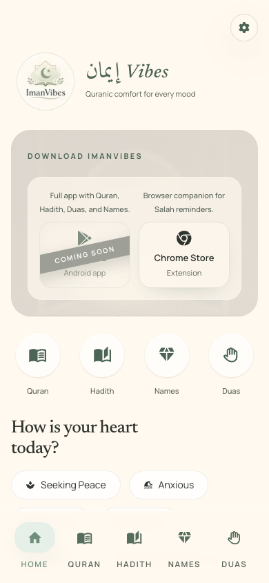
  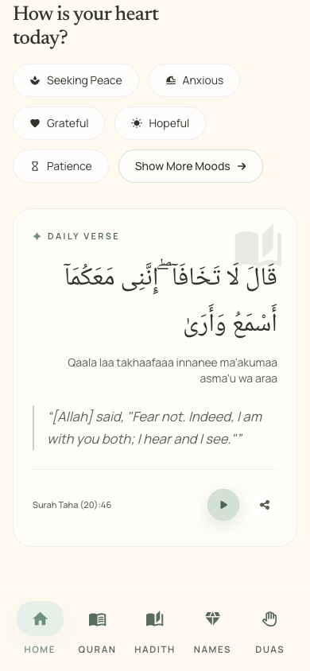
  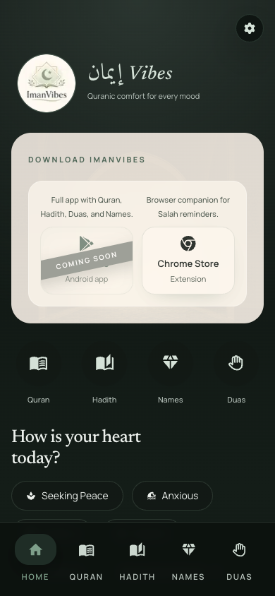
</p>

<p align="center">
  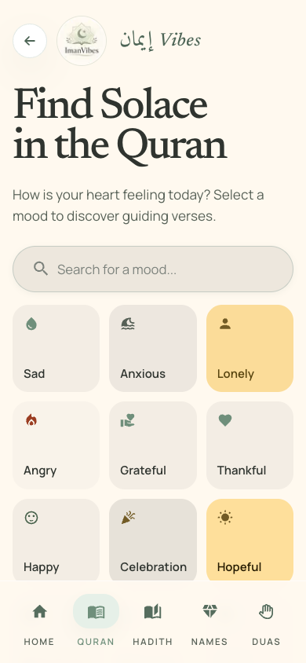
  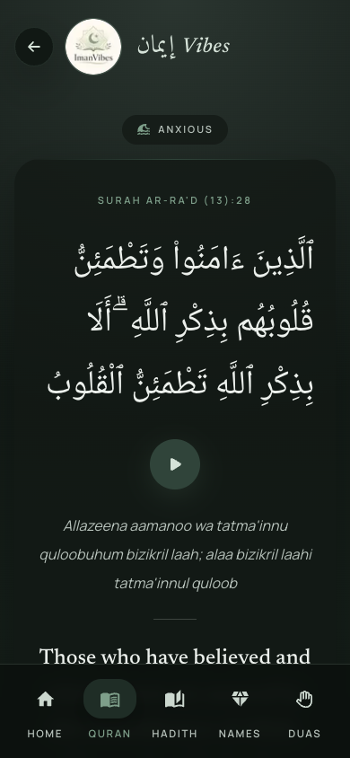
  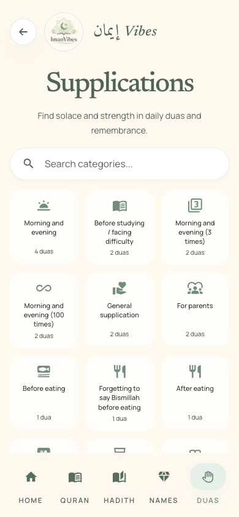
</p>

<details open>
<summary><strong>📸 Full web screenshot set</strong></summary>

| Home                                                                                                           | Daily Verse                                                                                                     | Settings                                                                                              |
| -------------------------------------------------------------------------------------------------------------- | --------------------------------------------------------------------------------------------------------------- | ----------------------------------------------------------------------------------------------------- |
|  |  | 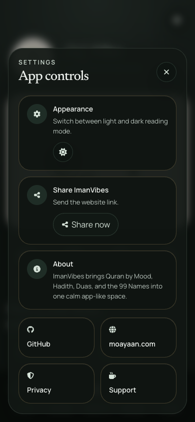 |

| Quran                                                                                                    | Quran Detail                                                                                             | Hadith                                                                                        |
| -------------------------------------------------------------------------------------------------------- | -------------------------------------------------------------------------------------------------------- | --------------------------------------------------------------------------------------------- |
|  |  | 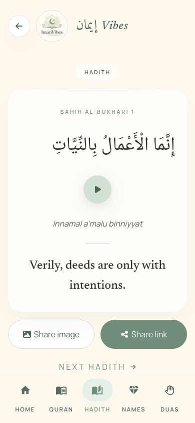 |

| Hadith Detail                                                                                         | 99 Names                                                                                       | Name Detail                                                                                       |
| ----------------------------------------------------------------------------------------------------- | ---------------------------------------------------------------------------------------------- | ------------------------------------------------------------------------------------------------- |
| 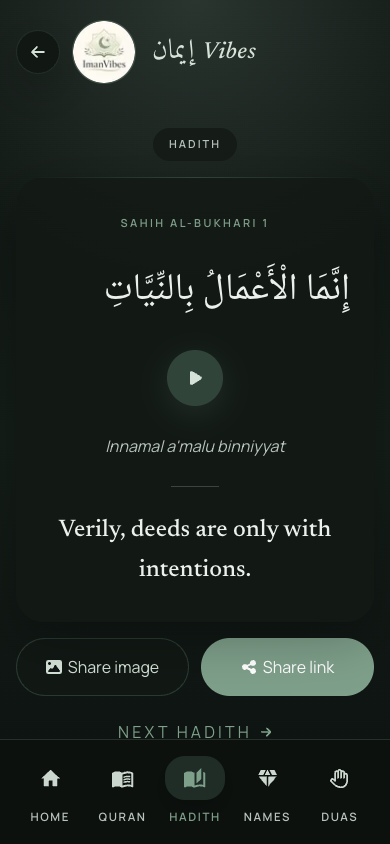 | 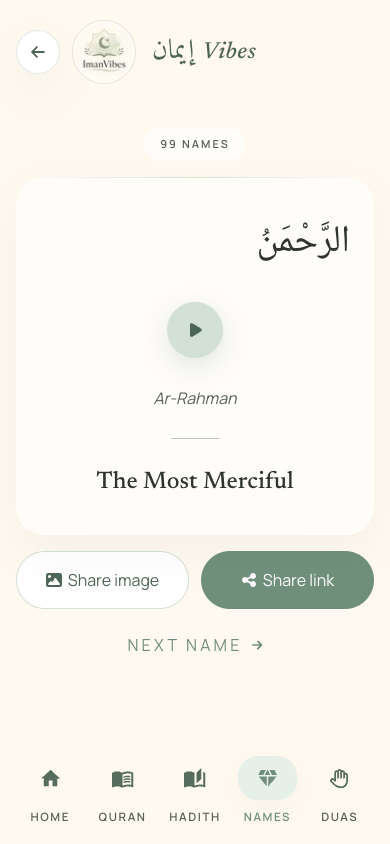 | 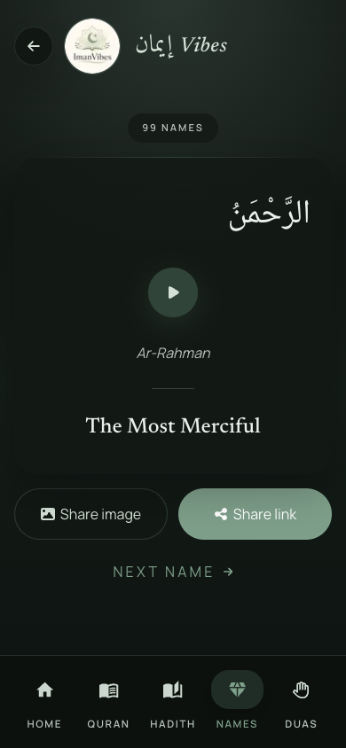 |

| Duas                                                                                      | Dua Detail                                                                                      | Privacy                                                                                         |
| ----------------------------------------------------------------------------------------- | ----------------------------------------------------------------------------------------------- | ----------------------------------------------------------------------------------------------- |
|  | 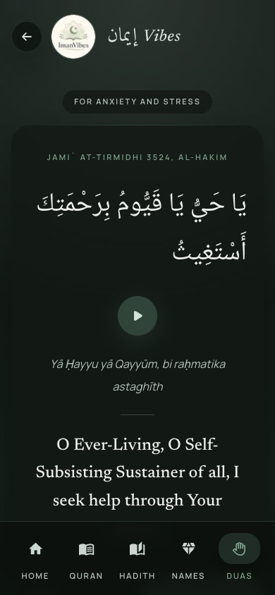 | 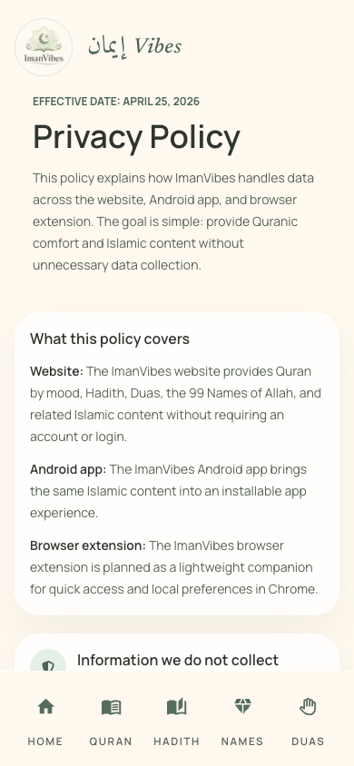 |

</details>

---

## 🧩 Chrome Extension Preview

<p align="center">
  <a href="https://chromewebstore.google.com/detail/mdgclabcabbbikdgmihabnaeplkfnnkb?utm_source=item-share-cb">
    
  </a>
</p>

<p align="center">
  <a href="https://chromewebstore.google.com/detail/mdgclabcabbbikdgmihabnaeplkfnnkb?utm_source=item-share-cb">
    <strong>Install ImanVibes Salah Companion on Chrome Web Store</strong>
  </a>
</p>

| Light Home                                                                                               | Light Schedule                                                                                                   |
| -------------------------------------------------------------------------------------------------------- | ---------------------------------------------------------------------------------------------------------------- |
| 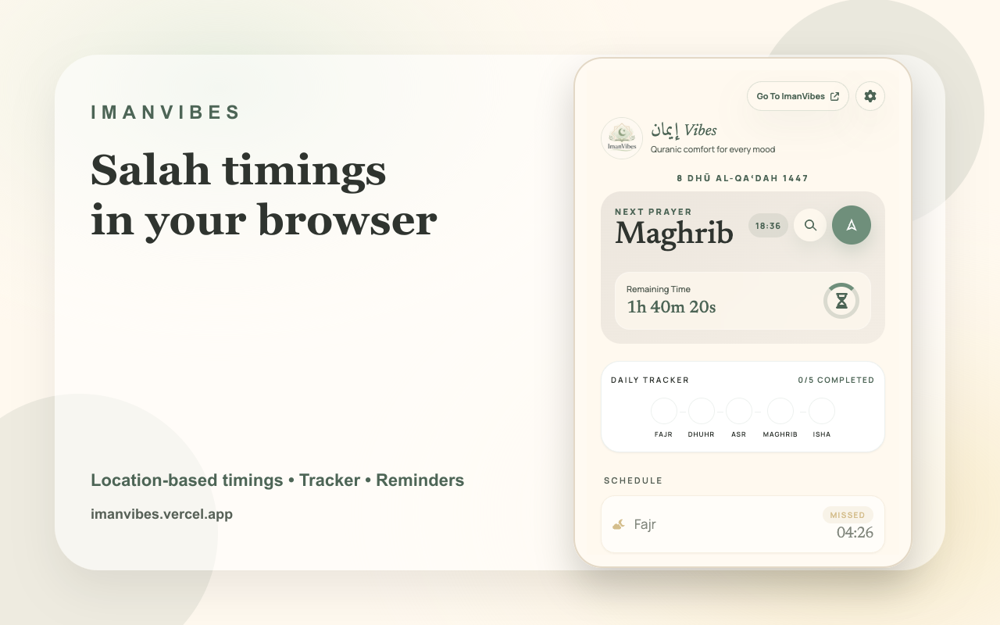 | 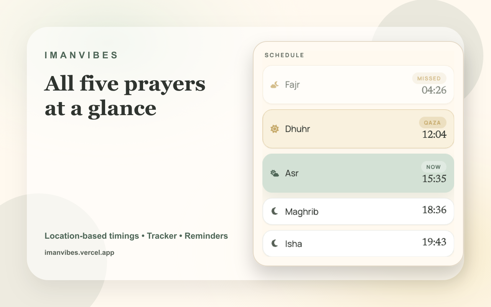 |

| Dark Settings                                                                                                  | Dark Home                                                                                              |
| -------------------------------------------------------------------------------------------------------------- | ------------------------------------------------------------------------------------------------------ |
| 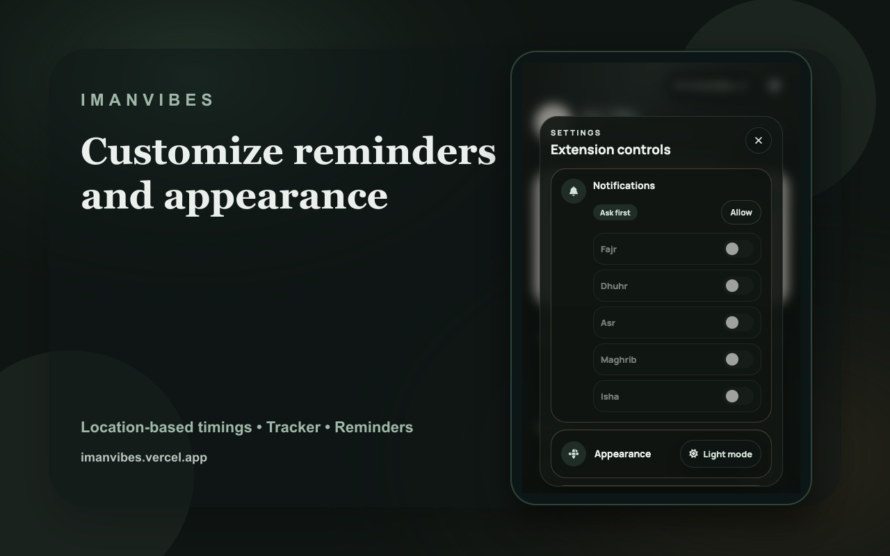 | 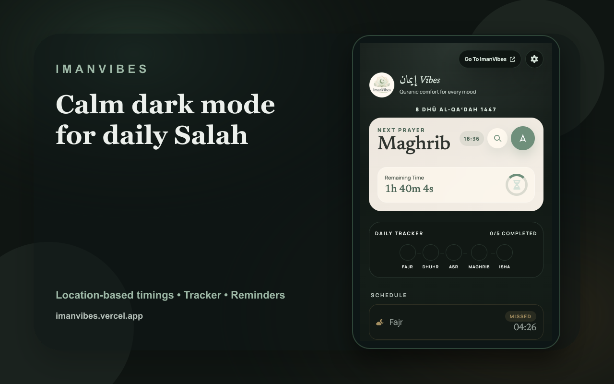 |

### Extension Features

- 🕌 Location-based Salah timings inside the browser
- ⏳ Next prayer countdown with calm visual focus
- ✅ Daily tracker for Fajr, Dhuhr, Asr, Maghrib, and Isha
- 🔔 Browser reminder flow for selected Salah times
- 🌗 Light and dark visual modes
- 🔗 Quick shortcut back to the ImanVibes website

---

## 📱 Android App: Coming Soon

The Android app is planned for Play Store distribution after the closed testing path is ready.

### Planned Android Experience

- 📖 Quran by Mood with Arabic, transliteration, translation, and source
- 📚 Hadith, Duas, and 99 Names in the same calm app style
- 🕌 Salah timings, tracker, and reminder controls
- 📿 Tasbih counter for daily dhikr
- 🔊 Arabic audio playback where available
- 🌗 Native-feeling light and dark reading modes
- 📤 Share links and branded share images

No Android screenshots are included yet because the public Play Store flow is still coming soon.

---

## 💎 Web Features

| Area           | Included                                                               |
| -------------- | ---------------------------------------------------------------------- |
| 📖 Quran       | Mood picker, verse cards, Arabic, transliteration, translation, source |
| 📚 Hadith      | Hadith collection, detail routes, Arabic audio, share actions          |
| 🤲 Duas        | Occasion categories, dua cards, transliteration, source references     |
| 💠 99 Names    | Arabic names, transliteration, meaning, detail pages                   |
| 🌤️ Daily Verse | Deterministic daily reflection on the home screen                      |
| 🔎 Search      | Quran mood search and dua occasion search                              |
| 🔊 Audio       | Arabic TTS through the `/api/tts` route                                |
| 📤 Sharing     | Copy link, WhatsApp, X, Telegram, share image, download image          |
| 🌙 Theme       | Persistent light and dark mode                                         |
| 📲 PWA         | Installable web app with manifest and service worker                   |
| 🖼️ OG Images   | Dynamic Open Graph images for pages and quote shares                   |

---

## 🧭 Core Flow

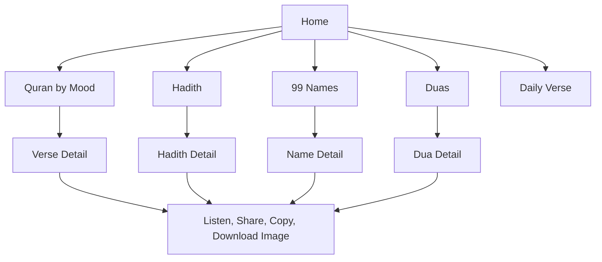

---

## 🔗 Routes

| Route              | Purpose                                                      |
| ------------------ | ------------------------------------------------------------ |
| `/`                | Home, download section, quick links, mood chips, Daily Verse |
| `/quran`           | Quran mood picker                                            |
| `/quran/[mood]`    | Quran verses for a selected mood                             |
| `/hadith`          | Hadith collection landing page                               |
| `/hadith/[item]`   | Item-specific Hadith page                                    |
| `/names`           | 99 Names collection page                                     |
| `/names/[item]`    | Item-specific Name page                                      |
| `/duas`            | Dua occasion picker                                          |
| `/duas/[occasion]` | Duas for a selected occasion                                 |
| `/privacy`         | Privacy policy                                               |
| `/temp`            | Local OG preview route for development review                |

---

## 🛠️ Tech Stack

- ⚡ Next.js 16 App Router
- ⚛️ React 19
- 🧠 TypeScript
- 🎨 Tailwind CSS 4
- 🖼️ React Icons
- 🔊 `node-edge-tts` for Arabic TTS generation
- 📸 `html-to-image` for branded share image creation
- 📊 Vercel Analytics
- 🗂️ Static local JSON content

---

## 🧾 Content Integrity

All Islamic content is read from local JSON:

- `islamic_final.json`

Rules followed by the app:

- Quran, Hadith, and Dua text is rendered exactly as stored
- No paraphrasing of Islamic source text
- No user-generated content
- No database
- No auth
- No content mutation

---

## 🚀 Local Development

```bash
npm install
npm run dev
```

Quality checks:

```bash
npm run lint
npm run build
```

Open:

```bash
http://localhost:3000
```

---

## 🗂️ Project Structure

```text
app/
  page.tsx
  quran/page.tsx
  quran/[mood]/page.tsx
  hadith/page.tsx
  hadith/[item]/page.tsx
  names/page.tsx
  names/[item]/page.tsx
  duas/page.tsx
  duas/[occasion]/page.tsx
  privacy/page.tsx
  og/
  api/tts/route.ts
  manifest.ts
  robots.ts
  sitemap.ts

components/
  AppHeader.tsx
  AudioPlayer.tsx
  BottomNav.tsx
  BrandWordmark.tsx
  ContentCard.tsx
  DailyVerseCard.tsx
  DownloadComingSoon.tsx
  SearchableGrid.tsx
  SettingsSheet.tsx
  ShareButton.tsx
  ThemeToggle.tsx

lib/
  content.ts
  og.tsx
  seo.ts
  site.ts
  structured-data.ts

public/
  icon2Circular.png
  screenshots/readme/

islamic_final.json
```

---

## 🧪 Screenshot Assets

Fresh README screenshots are stored here:

- `public/screenshots/readme/web/`
- `public/screenshots/readme/extension/`

Raw Playwright capture copies are also kept in:

- `output/playwright/readme-capture/`

---

## 🌍 Links

- 🌐 Website: [https://imanvibes.vercel.app](https://imanvibes.vercel.app)
- 🧩 Chrome Extension: [ImanVibes Salah Companion](https://chromewebstore.google.com/detail/mdgclabcabbbikdgmihabnaeplkfnnkb?utm_source=item-share-cb)
- 💻 GitHub: [https://github.com/moayaan1911/imanvibes](https://github.com/moayaan1911/imanvibes)
- 🙋‍♂️ Developer: [https://moayaan.com](https://moayaan.com)

---
